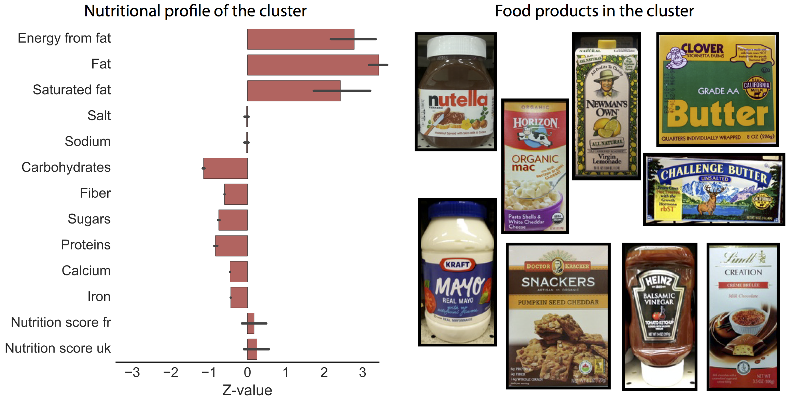

# [The Infinite Mixtures of Food Products](http://dl.acm.org/citation.cfm?id=3000591.2983445&coll=portal&dl=ACM)

<figure><figcaption>A cluster of food products discovered by mining the Open Food Facts data. Nutritional profile of the cluster shows that foods in the cluster are low in carbohydrates, fiber, sugars, proteins, calcium and iron, but high in energy and fat (left). Examples of products assigned to this cluster are well aligned with the nutritional profile of the cluster (right). (Source of the images: The Open Food Facts, http://openfoodfacts.org)
</figcaption></figure>
